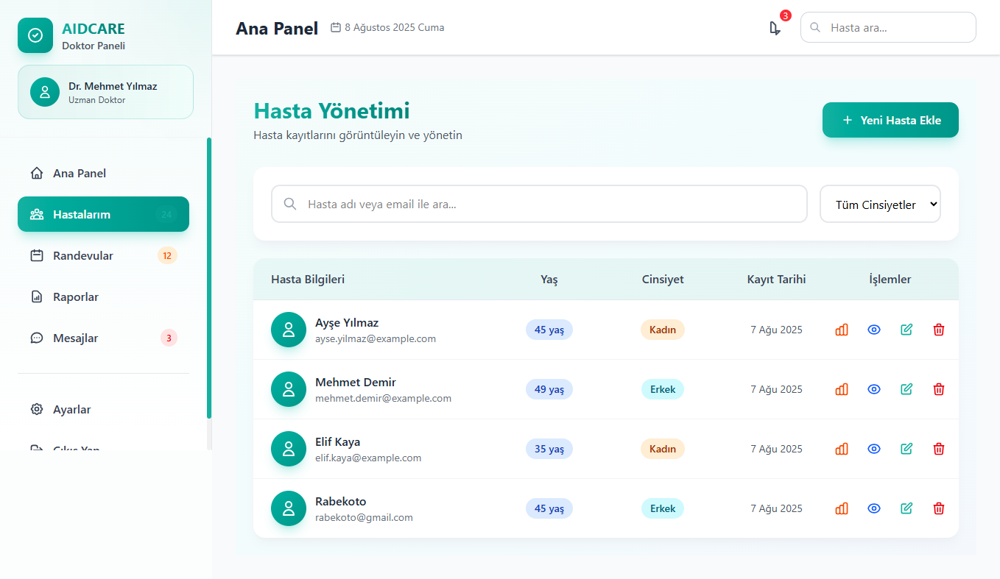
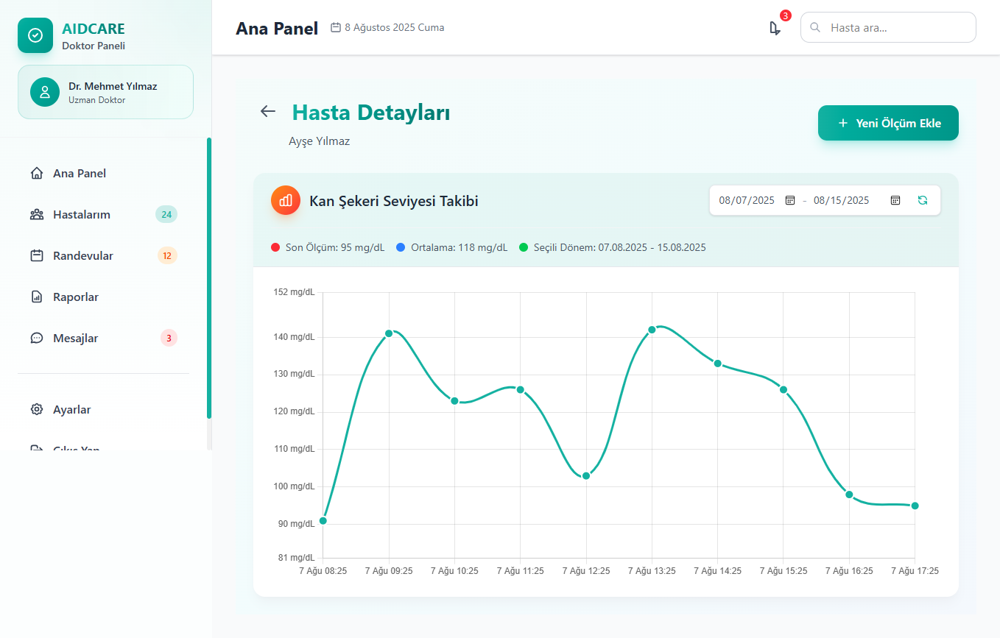

```markdown
# AIDCARE Diyabet Hasta Yönetim Uygulaması

## 📌 Proje Açıklaması

**AIDCARE** diyabet hastalarının yönetimi için geliştirilmiş bir web uygulamasıdır.  
Proje 3 ana klasörden oluşmaktadır:

- **backend**
- **db**
- **frontend**

### 1. Veritabanı (Database)

- **PostgreSQL** üzerinde hasta bilgileri (`patients`) ve kan şekeri ölçümleri (`glucose_levels`) için iki ana tablo oluşturuldu.
```

CREATE TABLE IF NOT EXISTS patients (
id SERIAL PRIMARY KEY,
name VARCHAR(100) NOT NULL,
email VARCHAR(100) UNIQUE,
phone VARCHAR(100) UNIQUE,
tc_number VARCHAR(100) UNIQUE,
birth_date DATE,
gender VARCHAR(10) NOT NULL,
address TEXT,
medical_notes TEXT,
created_at TIMESTAMP DEFAULT CURRENT_TIMESTAMP,
updated_at TIMESTAMP DEFAULT CURRENT_TIMESTAMP
);

CREATE TABLE IF NOT EXISTS sugar_levels (
id SERIAL PRIMARY KEY,
patient_id INTEGER REFERENCES patients(id),
measured_at TIMESTAMP,
sugar_value INTEGER
);

```

### 2. Backend Geliştirme
- **Node.js + Express** kullanılarak REST API endpoint’leri geliştirildi:
  - `GET /patients` → Tüm hastaları listeleme
  - `GET /patients/:id` → Tek bir hastayı görüntüleme
  - `POST /patients` → Yeni hasta ekleme
  - `PUT /patients/:id` → Hasta bilgilerini güncelleme
  - `DELETE /patients/:id` → Hasta silme
- **Proxy yapılandırması** ile `/api/*` istekleri otomatik olarak `http://localhost:3000` backend adresine yönlendirildi.
- **Redis cache** ile tüm `GET` endpoint’leri **60 saniye** süreyle önbelleklendi.

### 3. Frontend
- **Vue.js** kullanılarak doktor paneli tasarlandı.
- **Panel Giriş Sayfası** (mock authentication, sadece test amaçlı)
- **Doktor Paneli**:
  - Hasta ekleme formu (modal şeklinde)
  - Hasta düzenleme ve silme işlemleri
  - Hasta listesi (4 ana işlem butonu ile)
    1. Hastanın glukoz ölçümlerini gösterme
    2. Hasta detaylarını modal pencerede gösterme
    3. Hasta bilgilerini düzenleme
    4. Hasta kaydını silme
- **Hasta Ölçüm Sayfası**:
  - Hastanın glukoz ölçümlerini **Vue Chart.js Line Chart** ile grafik olarak görüntüleme.
- **Seeder**:
  - Demo için 3 hasta ve her birine ait 10 adet glukoz ölçüm verisi otomatik olarak eklendi.

---

## 📂 Proje Klasör Yapısı
```

AIDCARE/
├── backend/ # Node.js + Express backend kodları
├── db/ # PostgreSQL tablo oluşturma scriptleri
├── frontend/ # Vue.js doktor paneli

````

---

## ⚙️ Gereksinimler
- **Docker Desktop** veya herhangi bir Docker ortamı
- **Node.js**

---

## 🚀 Kurulum

### 1. Backend, Veritabanı ve Redis

```bash
docker compose build backend db redis
docker compose up backend db redis
````

Veya tek satırda:

```bash
docker compose up backend db redis --build
```

### 2. Frontend

```bash
cd frontend
npm install
npm run serve
```

---

## 🛠 Kullanılan Teknolojiler

- **Docker**
- **PostgreSQL**
- **Redis**
- **Node.js + Express**
- **Vue.js**
- **Chart.js (Vue Chart JS 5)**

---

## 📷 Demo Ekran Görüntüleri

### Hasta Listesi



### Kan Şekeri Grafiği


